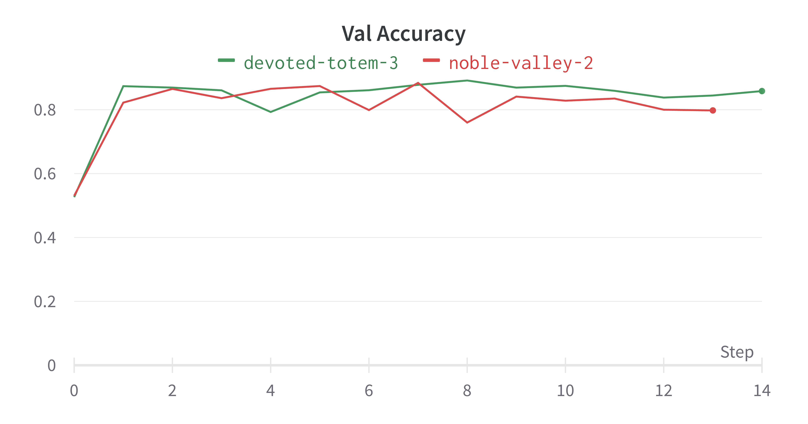

# Link

WandB: https://wandb.ai/arth-shukla/Pointnet%20Chair%20Part%20Segmentation

Equivalent Colab Notebook: https://colab.research.google.com/drive/1KPnxB51byFmCmQPRB1X-nGOJj8g5rdfo

# Papers Used

PointNet: Deep Learning on Point Sets for 3D Classification and Segmentation | Charles R. Qi, Hao Su, Kaichun Mo, Leonidas J. Guibas | https://arxiv.org/pdf/1612.00593.pdf

# Technologies Used

Architectures/Data Types: PointNet, PointClouds

AI Development: Pytorch (Torch, TorchVision, Cuda, Dataloaders, Custom Datasets), Open3D, WandB

# Evaluation and Inference

Visualizations and Figures available on WandB: https://wandb.ai/arth-shukla/Pointnet%20Chair%20Part%20Segmentation

The Colab Notebook also includes Open3D visualizations, which may be easier to use than WandB: https://colab.research.google.com/drive/1KPnxB51byFmCmQPRB1X-nGOJj8g5rdfo

Since the segmentation here has only one category of one class, convergence is very fast. The following shows two different runs:

<table>
    <tr>
        <td></td>
        <td></td>
    </tr>
    <tr>
        <td></td>
        <td></td>
    </tr>
</table>

In general, after reaching about 88% accuracy on train, the model starts to overfit on train data and vall accuracy can slightly decline.

The model is able to perform part segmentation to differentiate between arms, legs, back, and seat:

# Performance Comments

Batch Size of 16 only takes 5GB VRAM. Larger batch sizes can be used for faster training

# Future Improvements

Currently the model uses Adam to optimize. This can be paired with a scheduler to obtain better convergence results. Alternatively, SGD could be used for better results, though longer train time.

# About Me

Arth Shukla [Site](https://arth.website) | [GitHub](https://github.com/arth-shukla) | [LinkedIn](https://www.linkedin.com/in/arth-shukla/)
